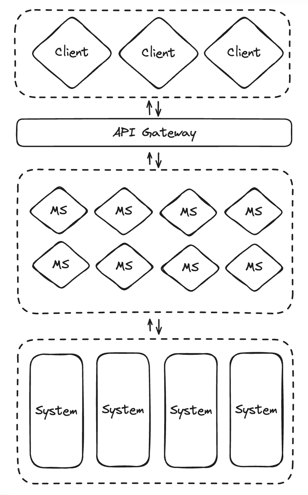

Cloud Native architectures have emerged as facilitators of agility, speed, safety, and adaptability for software applications. However, the formal definition of 'cloud native' lacks uniformity, as it carries varied interpretations among different individuals. The closest comprehensive definition is provided by the Cloud Native Computing Foundation (CNCF), and it is:

> Cloud native technologies empower organizations to build and runscalable applications in modern, dynamic environments such aspublic, private, and hybrid clouds. Containers, service meshes,microservices, immutable infrastructure, and declarative API semplify this approach. These techniques enable loosely coupled systems that are resilient, manageable, and observable. Combined with robust automation, they allow engineers to make high-impactchanges frequently and predictably with minimal toil.

In simpler terms, a "Cloud Native" architecture involves constructing software applications as a set of **independent**, **loosely connected**, **business-focused** services. These services are designed to operate in dynamic environments—be it public, private, hybrid, or multicloud—using automation to ensure **scalability**, **resilience**, **manageability**, and **observability**.

As inferred from the earlier definition, **microservices** constitute the fundamental architectural principle crucial for constructing cloud-native applications. In a microservices architecture, a software application is conceptualized as a set of autonomous, business-capability-focused services. These services are developed, deployed, and often managed independently by distinct teams. Microservices operate without sharing databases, and external entities can only access data through service interfaces. Each microservice is responsible for implementing both the business logic and inter-service communication features, encompassing aspects such as resiliency and security.

