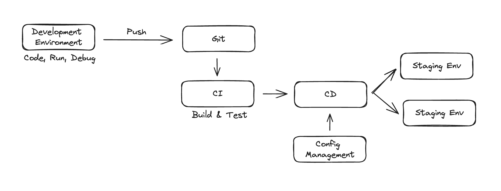

Cloud Native architectures have emerged as facilitators of agility, speed, safety, and adaptability for software applications. However, the formal definition of 'cloud native' lacks uniformity, as it carries varied interpretations among different individuals. The closest comprehensive definition is provided by the Cloud Native Computing Foundation (CNCF), and it is:

> Cloud native technologies empower organizations to build and runscalable applications in modern, dynamic environments such aspublic, private, and hybrid clouds. Containers, service meshes,microservices, immutable infrastructure, and declarative API semplify this approach. These techniques enable loosely coupled systems that are resilient, manageable, and observable. Combined with robust automation, they allow engineers to make high-impactchanges frequently and predictably with minimal toil.

In simpler terms, a "Cloud Native" architecture involves constructing software applications as a set of **independent**, **loosely connected**, **business-focused** services. These services are designed to operate in dynamic environments—be it public, private, hybrid, or multicloud—using automation to ensure **scalability**, **resilience**, **manageability**, and **observability**.

As inferred from the earlier definition, **microservices** constitute the fundamental architectural principle crucial for constructing cloud-native applications. In a microservices architecture, a software application is conceptualized as a set of autonomous, business-capability-focused services. These services are developed, deployed, and often managed independently by distinct teams. Microservices operate without sharing databases, and external entities can only access data through service interfaces. Each microservice is responsible for implementing both the business logic and inter-service communication features, encompassing aspects such as resiliency and security.

Maintaining the independence and autonomy of microservices, ensuring they are self-sufficient and encapsulated, is a fundamental process in the Cloud Native landscape, and **containerization** plays a pivotal role in achieving this. Containers are an essential component for packaging and running cloud-native applications.
A container is a live process isolated from the host operating system and other system processes. It interacts with its dedicated private filesystem, provided by a container image. The container encapsulates everything required to run an application, including the application code, its dependencies, and runtime.
Containerization bestows portability upon your microservices, ensuring consistent execution across diverse environments. This not only enhances flexibility but also guarantees uniformity in performance regardless of the deployment environment.

In the realm of real-world cloud-native applications, manually managing containers becomes nearly impossible, underscoring the significance of container orchestration in overseeing the complete container lifecycle. In this domain, **Kubernetes** has emerged as the de facto standard for container orchestration. Kubernetes establishes an abstraction layer atop containers, streamlining orchestration by automating deployment and other container management tasks. This automation enhances the portability, scalability, and extensibility of application workloads, bringing standardization to application processes and simplifying container orchestration.
A Kubernetes cluster essentially consists of two components: a **Control Plane Node** responsible for cluster management, and a set of _Worker Nodes_ where the applications workflow are executed. This division of responsibilities ensures effective coordination and execution of containerized applications.

Facing with the development cloud-native applications, **agility**, **speed**, and **security** are paramount. Achieving these goals necessitates the streamlining of the entire lifecycle of cloud-native application development and the automation of every feasible step.

**Automation** in the context of cloud-native applications revolves around eliminating manual tasks in the development lifecycle. This encompasses activities like running **integration tests**, **managing builds**, **releases**, **configuration**, **infrastructure**, and overseeing **continuous integration** (CI) and **continuous delivery/deployment** (CD).

In automating the creation of the target environment (dev, staging, or production), the technique of **infrastructure as code (IaC)** is widely employed. IaC involves managing infrastructure elements (networks, VMs, load balancers, and connection topology) using a declarative model akin to the source code of an application. This model enables the continuous creation of the required environment without manual intervention, thereby enhancing development speed and efficiency while maintaining consistency and reducing management overhead.

As organizations embrace Cloud Native principles, understanding these fundamentals and implementing best practices becomes critical for building and maintaining resilient, scalable, and agile applications in the cloud-native landscape.
